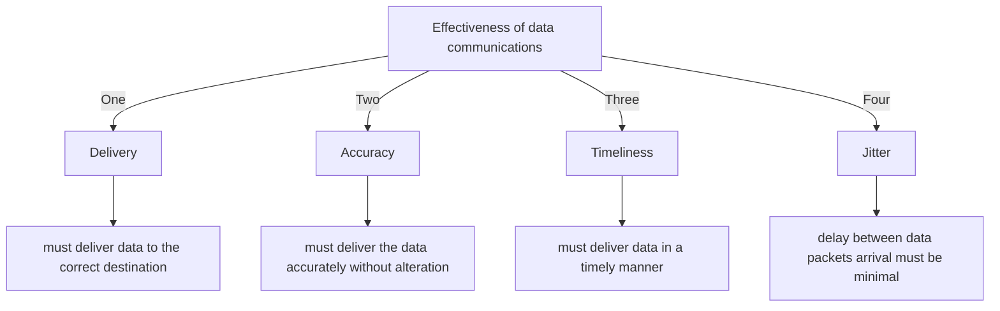

```mermaid
flowchart TD

    A[Effectiveness of data communications]

    A -->|One| D[Delivery]

    A -->|Two| E[Accuracy]

    A -->|Three| F[Timeliness]

    A --> |Four| G[Jitter]

    D --> H[must deliver data to the correct destination]

    E --> I[must deliver the data accurately without alteration]

    F --> J[must deliver data in a timely manner]

    G --> K[delay between data packets arrival must be minimal]
```
